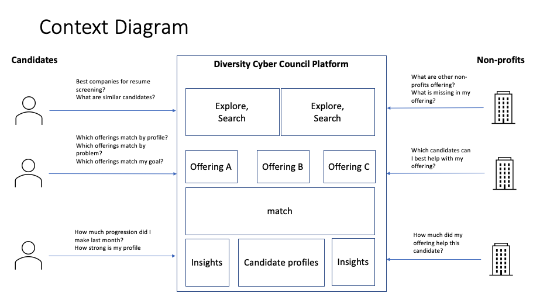
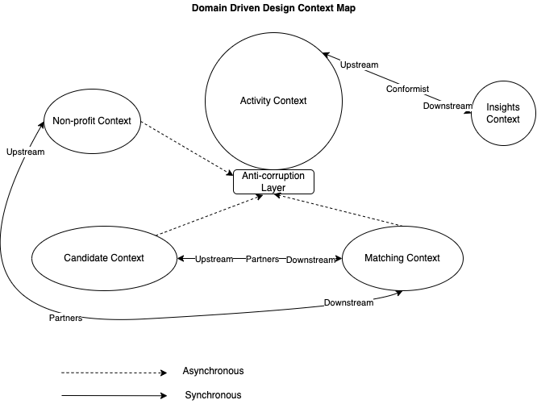
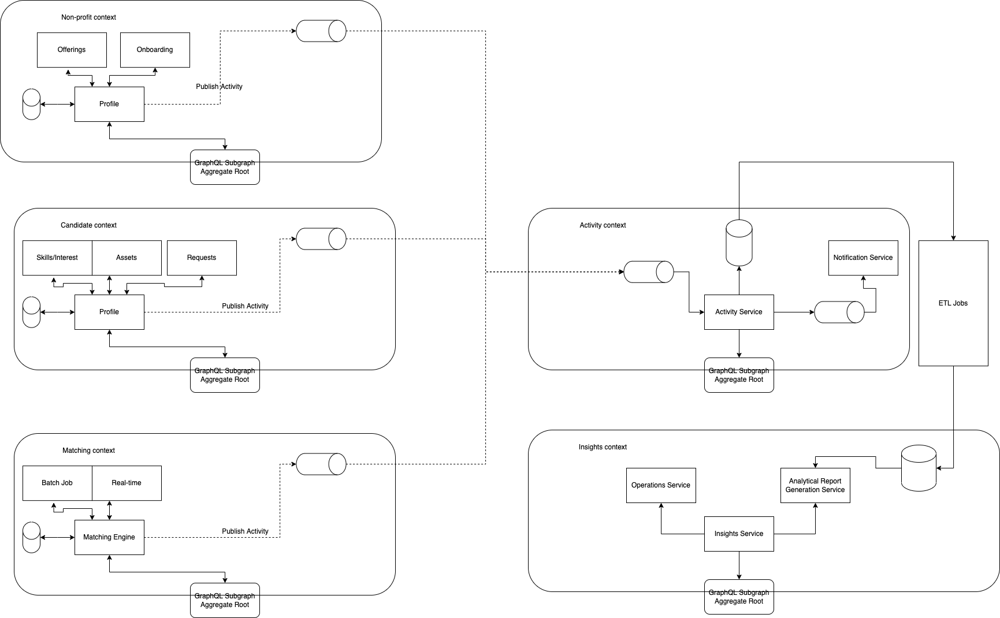
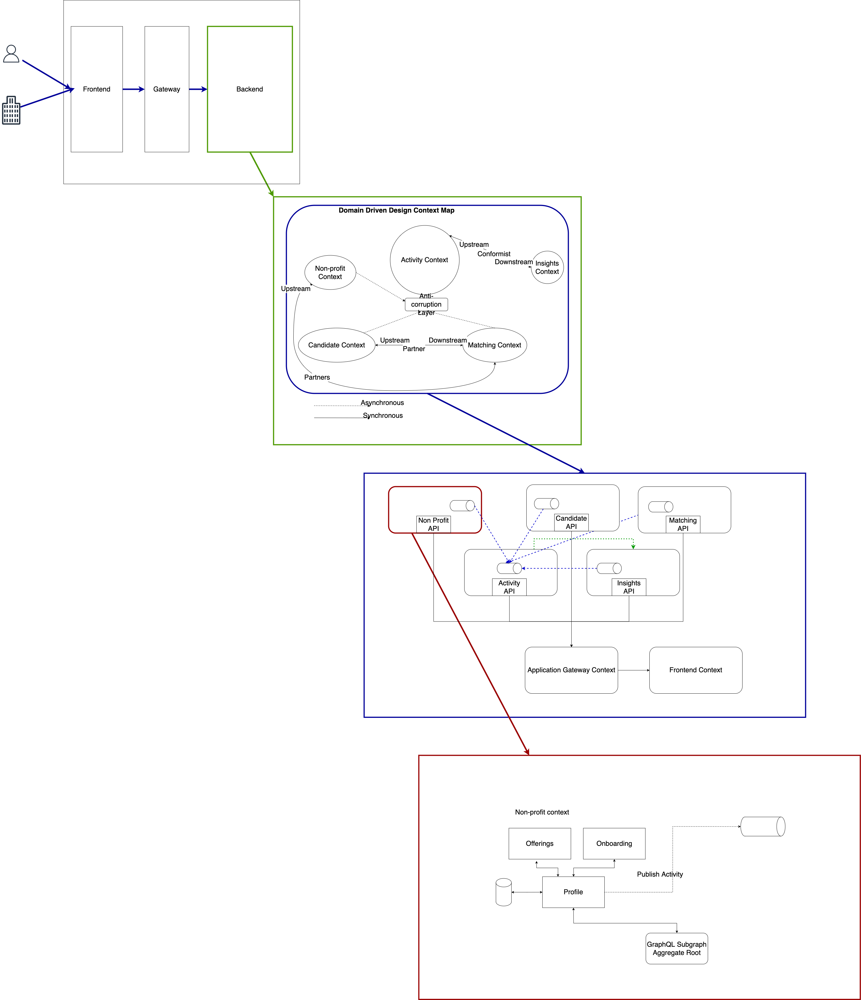
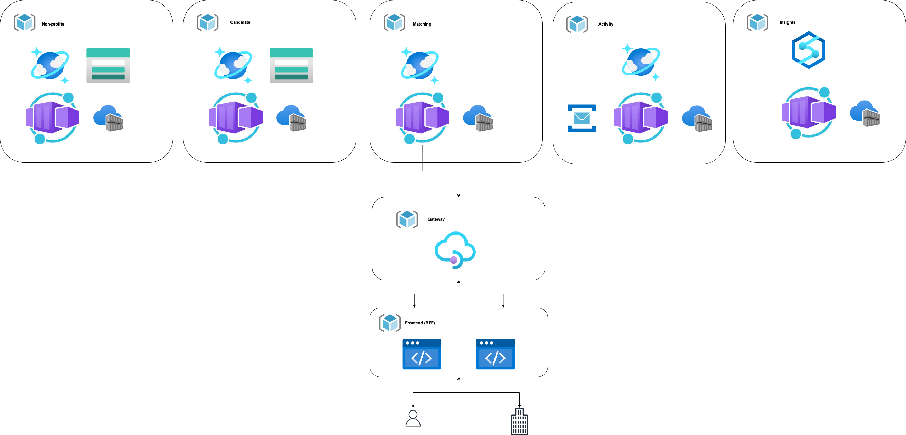

# Spring 2022 - O'Reilly Architecture Katas

This repository contains the materials offered for submission, for our participation in the 
[O'Reilly Spring 2022 Architecture KATA class](https://learning.oreilly.com/featured/architectural-katas/) course.

## Document outline

_Overview_

- [Executive summary](#executive-summary)
- [Narrative](#narrative)

_non technical_

- [Ubiquitous Language](#ubiquitous-language-a-language-shared-by-all-stakeholders)
- [Persona's](#personas)
- [User Stories](#user-stories)
- [System boundaries](#defining-the-system-boundaries)
- [Context Diagram](#ddd-context-map-in-depth-level-3)

_technical_

:triangular_flag_on_post: @TODO update when all diagrams are present

## Executive Summary

:triangular_flag_on_post: @TODO - check this summary for completeness

We are assigned to task to develop a platform, which:

1. Solves the issues stemming from the decentralization and lack of support between nonprofits (i.e. gaps of service and reduced overall impact).
2. Improves the visibility of nonprofit groups and offerings; and remove barriers of access to the people we aim to serve.

The system needs to

_resolution_
We propose

## Narrative

> “The test of our progress is not whether we add more to the abundance of those who have much; it is whether we provide enough for those who have too little.”
> ― Franklin D. Roosevelt

Diversity Cyber Council has launched a program named _Spotlight Platform_ with the goal to establish a sustainable and diverse talent pipeline that extends career equity to underrepresented demographics by providing access to competent training programs that lead to direct employment opportunities. The project name inherently says it all, there is an abundance of light, we just need to make sure it points at the right person. And for that, we are here to help. We'll guide you through our recommended approach of solving some of the challenges you are facing and transition towards a state in which you'll reap the benefits of the vision you have established.

## Ubiquitous Language (A language shared by all stakeholders)

The following list provides a list of definitions, to establish terms that are relevant for the content and ensure there are no misconceptions about what is meant by them.

- **Non-profit organisation** ("non-profit") Group of people that aims to help under-represented demographics in the tech industry by facilitating education, training, and staffing opportunities to establish a sustainable and diverse talent pipeline to the workforce without a profit motive.
- **Offering** collection of _services_ offered by a _non-profit_
- **Service** initiative deployed by a non-profit to help candidates overcome a particular challenge
- **Candidate** A member of an under-represented demographic that, consumer of non-profit offerings that is deliverd via the platform
- **Platform** An online system provided by the [Diversity Cyber Counsil](https://www.diversitycybercouncil.com/) both aimed at: helping, connecting and furthering candidates in their carreer in the tech industry, as well as support inter non-profit collaboration and sharing to fill in the gaps of service and overall impact.

_Idea borrowed from Eric Evan's book on Domain Driven Design - the Ubiquitous Language ([Domain-Driven Design : Tackling Complexity in the Heart of Software](https://www.dddcommunity.org/book/evans_2003/))_

## Personas

Two different profile's of the typical user of the platform (i.e. perona's) can be identified and described: 

- **Non-profit (the facilitator)** Kobe, 42, grew up in the suburbs of Chicago. He has witnessed first hand how difficult it can be to break away from stigmas and get a better life. Since 5 years he has been investing his time in helping people from underrepresented backgrounds to land their dream job. One of the things he loves working on is providing teenagers a connected experience. An experience in which they feel supported and empowered. Jonathon is good add coaching and seeing how small pieces of the puzzle fit together.

- **Candidate (the lifelong-learner)** Janine, 28, works 2 jobs at a supermarket and local restaurant, has the smarts and is eager to 'get out' bus doesn't know how. She has an interest in technology and would love to have a career at a tech company, but does not have the right education for it and therefore was not able to land a job in tech. She works long hours and doesn't make enough money to afford expensive training during working hours.
  She believes that given a chance for an interview, she'll be able to convince the company that she'll be of great value and is willing to learn anything to prove that.

_Note:_ whereas the 'platform administrator' role is certainly also relevant required to operate the platform, no persona was created because a) there is no 'experience' of the platform that they will have to do their administrative tasks, that requires understanding of their character and b) time considerations. 

## User stories

_User Story 1: [Engagement]_

As a **facilitator** I want to be able to share resources that have worked well for other candidates, so that candidates can take similer paths and be in a better situation to act/make decisions. --> sharing functionality

_User Story 2: [Discovery]_

As a **facilitator** I want to be able to find/group/filter (discover/search) candidates with similar needs/profiles, so that I can recommend them services which can help them in improving their current situation. --> search + Proactive reachout

_User Story 3: [Matching]_

As a **facilitator** I want to know which candidates are potential consumers, such that I know who to target and I'm in the best place to help these candidates solve their problems / reach their goals

_User Story 4: [Grow]_

As a **lifelong-learner** I want to know what my weakpoints are, such that I can create a curriculum to overcome these weaknesses and have a change of landing my dream job.

_User Story 5: [Reward]_

As a **lifelong-learner** I want to know how much progress I have made, such that I remain motivated to reach my goals and can celebrate milestones along the way.

_User Story 6: [Matching]_

As a **lifelong-learner** I want to know which offerings best match the problem I try to solve/goal I try to reach, such that I can make deliberate decisions which enable me to solve my problem or reach my goal

## Defining the system boundaries

We'll be leveraging a context diagram to create a simplified representation of our system which is understandable for a wide audience (i.e. technical and non-technical stakeholders). At first, we focus on the stakeholders we try to empower and leave the operational part out of scope (i.e. admin user). The context diagram as depicted in Figure 1:

## Domain Driven Design (DDD) Context Map (level 1 + 2)

On a high level, the [context diagram](#defining-the-system-boundaries) provides a very rough overview of the actors and key components. In this section, we'll group them together in domains. The domains provide clear boundaries between services and team, improve isolation and deployability, and simplify accountability.

The main parts identified in the context diagram, can roughly be grouped together in the following parts: Matching, Insights, Candidates, Non-profits.

These will be considered our domains (we'll cover how search and exploration is enabled through our technology choice in [Federated GraphQL](#federated-graphql) ). However, we believe one domain is missing. Activity plays a vital role within the entire solution. Consequently, we wan't to give it a separate domain to emphasize it's importance and have a dedicated team work on it to improve progress and innovation.

The domain driven design context map looks as follows: .

The following (technical) relations are important. There is a partnership regarding the schema design and implementation between the matching context and Non-profit/Candidate Context. Althought the Matching context is the consumer, both the non-profits and candidate context reap the benefits from a good matching algorithm, resulting in eagerness from both parties to partner up.

The activity context implements an Anti Corrruption layer to translate any concepts from other domains to its own domain. The activity context plays an important role as it is the central place from which insights can be derived (reports, but also search, discoverabilty and fill-in-the-gap)

The Insight Context conforms to the Activity Context's domain. It is a consumer without any power over the activity context and needs to conform (i.e. take it or leave it).

### DDD context-map in depth (level 3)

Summary:

- explain how we created domains, how did we?
- reference adr federated graphql: benefits, tradeoffs (the usual part)
- explain when chosing for events
- reference adr integration with subgraphs

If we go one level deeper and look at the specifics, we come to the following diagram 

Based on [federated graphql](./adr/00002-Integration-discoverability-and-search-through-federated-graphql.md) and [domains-expose-apis-through-subgraphs](./adr/00003-all-domains-expose-graphql-subgraphs.md), we come to the conclusion that integration between services is largely achieved through GraphQL federation. Each domain has its distinct subgraph which can be queried by external consumers through the graph api.

Moreover, all domains publish activity events to a message queue which is owned and consumed by the activity context. We choose to do this asynchronously as the activity context is not a user facing application. Besides using a message queue for publishing activities, we also leverage it for our notification service within the activity context.

Finally, a batch job is responsible for ingesting data in the data warehouse within the Insights context. This data will be used for generating the analytic reports.

## Domain services (level 4)

summary:
Per domain:

- one line what each block in the domain does
- what kind of storage we will leverage
- how service is exposed/communicates with other services

## Deployment Diagram
summary:
- explain platform choice
- explain why chosen services
- explain one other option
- link to bff adr which explains why went for backend for frontend

[Backend for Frontend (BFF)](./adr/0004-backend-for-frontend.md)

## How graphql enables innovation through integration

Summary:
- explain how discoverability improved
- explain how data integrity improved
- explain how offering search was improved
- Explain how insights generation was improved

## Federated GraphQL

Reference: [Diversity Cyber Council Kata Requirements 2022](https://docs.google.com/document/d/1XjEpcGJ87xYg1eWN9eE0_tH7te5HcVAgPvoONLHY4qQ/edit#)
